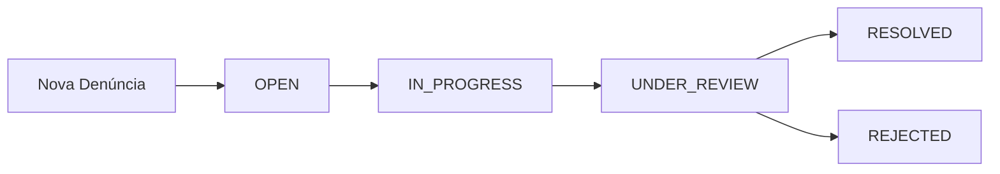

# 🎨 Canal de Denúncias - Frontend Design System

## 📌 Visão Geral

Sistema completo de Canal de Denúncias Corporativo com design moderno, profissional e responsivo, utilizando React, TypeScript e TailwindCSS.

---

## 🎨 Identidade Visual

### Paleta de Cores Principal

```css
/* Azul (Primary) */
--primary-50: #eff6ff
--primary-500: #2563eb  /* Azul principal */
--primary-700: #1d4ed8
--primary-900: #0f172a

/* Amarelo/Laranja (Accent) */
--accent-400: #facc15  /* Amarelo principal */
--accent-500: #eab308
--accent-600: #ca8a04
```

### Gradientes Corporativos

- **Hero Gradient**: `from-primary-600 to-primary-800`
- **Accent Gradient**: `from-accent-400 to-accent-600`
- **Background**: `from-blue-50 via-white to-yellow-50`

### Tipografia

- **Fonte**: Inter (Google Fonts)
- **Títulos**: font-black (900)
- **Corpo**: font-medium (500)
- **Labels**: font-semibold (600)

---

## 📁 Estrutura de Arquivos

```
apps/frontend/src/
├── pages/
│   ├── HomePage.tsx                 ✅ Landing page moderna
│   ├── LoginPage.tsx               ✅ Login com design split-screen
│   ├── DashboardPage.tsx           📊 Dashboard com métricas
│   ├── ProfilePage.tsx             👤 Perfil do usuário
│   ├── NotificationsPage.tsx       🔔 Central de notificações
│   ├── auth/
│   │   ├── LoginPage.tsx           ✅ Autenticação
│   │   └── RegisterPage.tsx        📝 Cadastro
│   ├── complaints/
│   │   ├── ComplaintsListPage.tsx  📋 Lista de denúncias
│   │   ├── ComplaintDetailPage.tsx 🔍 Detalhes da denúncia
│   │   ├── ComplaintCreatePage.tsx ➕ Nova denúncia
│   │   └── AnonymousComplaintPage.tsx 🕵️ Denúncia anônima
│   └── users/
│       └── UsersPage.tsx           👥 Gestão de usuários
├── components/
│   ├── layouts/
│   │   ├── PublicLayout.tsx        🌐 Layout público
│   │   └── PrivateLayout.tsx       🔒 Layout autenticado
│   ├── ui/
│   │   ├── Button.tsx              🔘 Botões estilizados
│   │   ├── Card.tsx                📦 Cards
│   │   ├── Input.tsx               ⌨️ Inputs
│   │   ├── Badge.tsx               🏷️ Badges de status
│   │   ├── Modal.tsx               🪟 Modais
│   │   └── Table.tsx               📊 Tabelas
│   └── dashboard/
│       ├── StatsCard.tsx           📈 Cards de estatísticas
│       └── ComplaintChart.tsx      📊 Gráficos
├── services/
│   ├── api.ts                      🌐 Cliente HTTP
│   ├── authService.ts              🔐 Autenticação
│   ├── complaintService.ts         📋 Denúncias
│   └── userService.ts              👤 Usuários
├── store/
│   ├── authStore.ts                🔐 Estado de autenticação
│   └── notificationStore.ts        🔔 Notificações
├── types/
│   └── index.ts                    📘 TypeScript types
└── index.css                        🎨 Estilos globais
```

---

## 🖥️ Páginas Implementadas

### 1️⃣ **HomePage** ✅

**Arquivo**: `src/pages/HomePage.tsx`

**Características**:
- ✨ Navbar fixa com logo e botões de ação
- 🎯 Hero section com títulos gigantes em gradiente
- 📱 100% responsivo (mobile-first)
- 🎴 4 cards flutuantes com ícones (Lock, Eye, Bell, Zap)
- 🎨 CTA final com fundo azul escuro e botão amarelo
- ⚡ Animações suaves em todos os elementos

**Seções**:
1. **Navigation**: Sticky navbar com logo gradiente
2. **Hero**: Títulos enormes com "Sua voz **importa** e é **protegida**"
3. **Feature Cards**: Grid 2x2 ou 4 colunas com ícones coloridos
4. **CTA**: Seção final impactante com call-to-action

**Cores Principais**:
- Fundo: `bg-gradient-to-br from-slate-50 via-blue-50 to-yellow-50`
- Cards: `bg-white/80 backdrop-blur-xl`
- Botões: Gradientes azul e amarelo

---

### 2️⃣ **LoginPage** ✅

**Arquivo**: `src/pages/auth/LoginPage.tsx`

**Características**:
- 📱 Design split-screen (formulário + hero)
- 🎨 Logo em gradiente azul no topo
- 🔐 Campos de email e senha estilizados
- 👁️ Toggle de visualização de senha
- ✅ Validação com React Hook Form + Zod
- 🎯 Links para "Esqueci senha" e "Criar conta"
- 📋 Card com credenciais de teste (demo)
- 🖼️ Lado direito com hero gradiente (desktop only)

**Features de UX**:
- ✨ Ícones nos inputs (Mail, Lock)
- 🎭 Feedback visual de erros
- 🔄 Loading state no botão
- 🎨 Animações de entrada (fade-in)

**Credenciais Demo**:
```
Email: admin@empresa.com
Senha: Demo123!@
```

---

### 3️⃣ **DashboardPage** 📊

**Arquivo**: `src/pages/DashboardPage.tsx`

**Características Previstas**:
- 📈 Cards de métricas (Total, Em Análise, Resolvidas, Rejeitadas)
- 📊 Gráficos interativos (Recharts):
  - Denúncias por status (Donut Chart)
  - Denúncias por mês (Line/Bar Chart)
  - Tempo médio de resolução
- 📋 Tabela com últimas denúncias
- 🎨 Design com gradientes azul → amarelo
- 📱 Responsivo (grid adaptativo)

**Componentes**:
- `StatsCard`: Métricas com ícone e valor
- `ComplaintChart`: Gráficos Recharts
- `RecentComplaints`: Tabela das últimas denúncias

---

### 4️⃣ **ComplaintsListPage** 📋

**Arquivo**: `src/pages/complaints/ComplaintsListPage.tsx`

**Características**:
- 🔍 Filtros avançados (status, data, tipo)
- 📊 Tabela com paginação
- 🏷️ Badges coloridos por status
- ➕ Botão "Nova Denúncia" destacado
- 📱 Cards em mobile, tabela em desktop
- ⚡ Busca em tempo real

**Status e Cores**:
```tsx
OPEN: yellow (bg-yellow-100 text-yellow-800)
IN_PROGRESS: blue (bg-blue-100 text-blue-800)
RESOLVED: green (bg-green-100 text-green-800)
REJECTED: red (bg-red-100 text-red-800)
```

---

### 5️⃣ **ComplaintDetailPage** 🔍

**Arquivo**: `src/pages/complaints/ComplaintDetailPage.tsx`

**Características**:
- 📄 Visualização completa da denúncia
- 💬 Timeline de comentários
- 📎 Anexos e evidências
- 🔄 Mudança de status com modal
- 👤 Atribuir investigador
- 📝 Criar dossiê
- 🎨 Layout em cards com sombras

**Modais**:
1. **Mudar Status**: Dropdown + textarea para observação
2. **Atribuir Investigador**: Select de usuários INVESTIGATOR

---

### 6️⃣ **AnonymousComplaintPage** 🕵️

**Arquivo**: `src/pages/complaints/AnonymousComplaintPage.tsx`

**Características**:
- 📝 Formulário público (sem login)
- 📎 Upload de anexos (PDF, imagens)
- 🎯 Seleção de tipo de denúncia
- 🔑 Geração de protocolo após envio
- ✅ Modal de sucesso com protocolo
- 🎨 Design limpo e convidativo

**Tipos de Denúncia**:
- Assédio Moral
- Assédio Sexual
- Fraude
- Corrupção
- Conflito de Interesses
- Outros

---

### 7️⃣ **UsersPage** 👥

**Arquivo**: `src/pages/users/UsersPage.tsx`

**Características**:
- 📊 Tabela de usuários
- ➕ Criar novo usuário
- ✏️ Editar usuário
- 🗑️ Deletar usuário
- 🏷️ Badges de role (ADMIN, INVESTIGATOR, VIEWER)
- 🔍 Filtro por role
- 📱 Cards em mobile

**Roles e Cores**:
```tsx
ADMIN: red (bg-red-100 text-red-800)
INVESTIGATOR: blue (bg-blue-100 text-blue-800)
VIEWER: gray (bg-gray-100 text-gray-800)
```

---

### 8️⃣ **ProfilePage** 👤

**Arquivo**: `src/pages/ProfilePage.tsx`

**Características**:
- 📸 Avatar do usuário
- 📝 Editar informações pessoais
- 🔒 Trocar senha
- 🔔 Preferências de notificações
- 🎨 Design em cards

---

### 9️⃣ **NotificationsPage** 🔔

**Arquivo**: `src/pages/NotificationsPage.tsx`

**Características**:
- 📋 Lista de notificações
- ✅ Marcar como lida
- 🗑️ Deletar notificação
- 🔔 Ícones por tipo
- ⏰ Timestamp relativo
- 📱 Cards scrolláveis

---

## 🎨 Sistema de Design (Tailwind Classes)

### Botões

```tsx
// Primary Button
className="px-10 py-5 text-lg font-bold text-white bg-gradient-to-r from-primary-600 to-primary-700 rounded-2xl shadow-2xl hover:shadow-primary-500/60 hover:-translate-y-1 transition-all"

// Secondary Button
className="px-10 py-5 text-lg font-bold text-primary-700 bg-white border-2 border-primary-200 rounded-2xl hover:bg-primary-50 hover:-translate-y-1 transition-all shadow-xl"

// Accent Button (CTA)
className="px-14 py-6 text-xl font-black text-primary-900 bg-gradient-to-r from-accent-400 to-accent-500 rounded-2xl shadow-2xl hover:scale-105 transition-all"
```

### Cards

```tsx
// Glass Card
className="bg-white/80 backdrop-blur-xl p-8 rounded-3xl shadow-xl border border-gray-100 hover:shadow-2xl hover:-translate-y-2 transition-all"

// Stat Card
className="bg-gradient-to-br from-white to-gray-50 p-10 rounded-3xl shadow-xl border border-gray-100 hover:-translate-y-2 transition-all"
```

### Badges

```tsx
// Status Badge
className="inline-flex items-center px-3 py-1 rounded-full text-sm font-semibold"

// Colors by status
OPEN: "bg-yellow-100 text-yellow-800 border border-yellow-200"
IN_PROGRESS: "bg-blue-100 text-blue-800 border border-blue-200"
RESOLVED: "bg-green-100 text-green-800 border border-green-200"
REJECTED: "bg-red-100 text-red-800 border border-red-200"
```

### Inputs

```tsx
className="block w-full pl-10 pr-3 py-3 border border-gray-300 rounded-xl focus:ring-2 focus:ring-primary-500 focus:border-transparent transition-all"
```

---

## 🎭 Animações e Transições

### CSS Global (`index.css`)

```css
@keyframes fadeIn {
  from { opacity: 0; transform: translateY(10px); }
  to { opacity: 1; transform: translateY(0); }
}

@keyframes pulse {
  0%, 100% { opacity: 1; }
  50% { opacity: 0.5; }
}

.animate-fade-in {
  animation: fadeIn 0.3s ease-out;
}

/* Scrollbar personalizada */
::-webkit-scrollbar {
  width: 10px;
}

::-webkit-scrollbar-thumb {
  background: #2563eb;
  border-radius: 5px;
}
```

### Classes Utilitárias

```tsx
// Hover Effects
hover:-translate-y-1     // Levita
hover:shadow-2xl         // Sombra aumenta
hover:scale-105          // Aumenta 5%
hover:border-primary-300 // Muda cor da borda

// Transitions
transition-all duration-300
transition-transform
transition-colors
```

---

## 📱 Responsividade

### Breakpoints Tailwind

```css
sm: 640px   /* Small devices */
md: 768px   /* Medium devices */
lg: 1024px  /* Large devices */
xl: 1280px  /* Extra large devices */
```

### Estratégia Mobile-First

```tsx
// Mobile (default)
className="flex flex-col gap-4"

// Tablet e acima
className="sm:flex-row md:gap-6"

// Desktop
className="lg:grid lg:grid-cols-3"
```

### Exemplos

```tsx
// Hero Title
className="text-5xl md:text-6xl lg:text-7xl"

// Grid Responsivo
className="grid grid-cols-1 md:grid-cols-2 lg:grid-cols-4 gap-4"

// Cards
className="grid grid-cols-2 md:grid-cols-4"
```

---

## 🔐 Autenticação e Rotas

### Rotas Públicas

```tsx
/                 → HomePage
/login            → LoginPage
/register         → RegisterPage
/denunciar        → AnonymousComplaintPage
```

### Rotas Privadas (Requer Auth)

```tsx
/dashboard        → DashboardPage
/denuncias        → ComplaintsListPage
/denuncias/:id    → ComplaintDetailPage
/denuncias/nova   → ComplaintCreatePage
/usuarios         → UsersPage
/perfil           → ProfilePage
/notificacoes     → NotificationsPage
```

### PrivateLayout

**Arquivo**: `src/components/layouts/PrivateLayout.tsx`

**Características**:
- 📱 Sidebar colapsável
- 🎨 Menu com ícones coloridos
- 👤 Avatar do usuário no topo
- 🔔 Notificações com badge
- 📱 Menu mobile (hamburguer)

**Menu Items**:
```tsx
{ icon: Home, label: 'Dashboard', path: '/dashboard' }
{ icon: FileText, label: 'Denúncias', path: '/denuncias' }
{ icon: Users, label: 'Usuários', path: '/usuarios' }
{ icon: User, label: 'Perfil', path: '/perfil' }
{ icon: Bell, label: 'Notificações', path: '/notificacoes' }
{ icon: Settings, label: 'Configurações', path: '/configuracoes' }
```

---

## 📊 Gráficos (Recharts)

### Instalação

```bash
npm install recharts
```

### Tipos de Gráficos

#### 1. Donut Chart (Status)

```tsx
import { PieChart, Pie, Cell, ResponsiveContainer, Legend, Tooltip } from 'recharts';

const data = [
  { name: 'Aberto', value: 45, color: '#fbbf24' },
  { name: 'Em Análise', value: 30, color: '#3b82f6' },
  { name: 'Resolvido', value: 20, color: '#10b981' },
  { name: 'Rejeitado', value: 5, color: '#ef4444' },
];

<ResponsiveContainer width="100%" height={300}>
  <PieChart>
    <Pie data={data} dataKey="value" nameKey="name" cx="50%" cy="50%" innerRadius={60} outerRadius={100}>
      {data.map((entry, index) => (
        <Cell key={`cell-${index}`} fill={entry.color} />
      ))}
    </Pie>
    <Tooltip />
    <Legend />
  </PieChart>
</ResponsiveContainer>
```

#### 2. Line Chart (Tendência)

```tsx
import { LineChart, Line, XAxis, YAxis, CartesianGrid, Tooltip, ResponsiveContainer } from 'recharts';

const data = [
  { month: 'Jan', denuncias: 12 },
  { month: 'Fev', denuncias: 19 },
  { month: 'Mar', denuncias: 15 },
  // ...
];

<ResponsiveContainer width="100%" height={300}>
  <LineChart data={data}>
    <CartesianGrid strokeDasharray="3 3" />
    <XAxis dataKey="month" />
    <YAxis />
    <Tooltip />
    <Line type="monotone" dataKey="denuncias" stroke="#2563eb" strokeWidth={3} />
  </LineChart>
</ResponsiveContainer>
```

#### 3. Bar Chart (Comparação)

```tsx
import { BarChart, Bar, XAxis, YAxis, CartesianGrid, Tooltip, ResponsiveContainer } from 'recharts';

<ResponsiveContainer width="100%" height={300}>
  <BarChart data={data}>
    <CartesianGrid strokeDasharray="3 3" />
    <XAxis dataKey="month" />
    <YAxis />
    <Tooltip />
    <Bar dataKey="denuncias" fill="#2563eb" radius={[8, 8, 0, 0]} />
  </BarChart>
</ResponsiveContainer>
```

---

## 🎯 Componentes UI Reutilizáveis

### Button Component

```tsx
interface ButtonProps {
  variant?: 'primary' | 'secondary' | 'outline' | 'danger';
  size?: 'sm' | 'md' | 'lg';
  children: React.ReactNode;
  onClick?: () => void;
  disabled?: boolean;
  type?: 'button' | 'submit';
  icon?: React.ReactNode;
}

export function Button({ variant = 'primary', size = 'md', ...props }: ButtonProps) {
  const baseClasses = 'inline-flex items-center justify-center font-semibold rounded-xl transition-all';
  
  const variants = {
    primary: 'bg-gradient-to-r from-primary-600 to-primary-700 text-white hover:shadow-lg',
    secondary: 'bg-white border-2 border-primary-200 text-primary-700 hover:bg-primary-50',
    outline: 'border-2 border-gray-300 text-gray-700 hover:bg-gray-50',
    danger: 'bg-red-600 text-white hover:bg-red-700',
  };
  
  const sizes = {
    sm: 'px-4 py-2 text-sm',
    md: 'px-6 py-3 text-base',
    lg: 'px-8 py-4 text-lg',
  };
  
  return (
    <button className={`${baseClasses} ${variants[variant]} ${sizes[size]}`} {...props}>
      {props.icon && <span className="mr-2">{props.icon}</span>}
      {props.children}
    </button>
  );
}
```

### Badge Component

```tsx
interface BadgeProps {
  children: React.ReactNode;
  variant: 'yellow' | 'blue' | 'green' | 'red' | 'gray';
}

export function Badge({ children, variant }: BadgeProps) {
  const variants = {
    yellow: 'bg-yellow-100 text-yellow-800 border-yellow-200',
    blue: 'bg-blue-100 text-blue-800 border-blue-200',
    green: 'bg-green-100 text-green-800 border-green-200',
    red: 'bg-red-100 text-red-800 border-red-200',
    gray: 'bg-gray-100 text-gray-800 border-gray-200',
  };
  
  return (
    <span className={`inline-flex items-center px-3 py-1 rounded-full text-sm font-semibold border ${variants[variant]}`}>
      {children}
    </span>
  );
}
```

### Card Component

```tsx
interface CardProps {
  children: React.ReactNode;
  className?: string;
  hover?: boolean;
}

export function Card({ children, className = '', hover = false }: CardProps) {
  return (
    <div className={`
      bg-white rounded-3xl shadow-xl border border-gray-100 p-6
      ${hover ? 'hover:shadow-2xl hover:-translate-y-2 transition-all duration-300' : ''}
      ${className}
    `}>
      {children}
    </div>
  );
}
```

---

## 🔔 Sistema de Notificações

### Toast Notifications (react-hot-toast)

```tsx
import toast, { Toaster } from 'react-hot-toast';

// Success
toast.success('Denúncia criada com sucesso!');

// Error
toast.error('Erro ao criar denúncia');

// Info
toast('Processando...', { icon: '⏳' });

// Custom
toast.custom((t) => (
  <div className="bg-white px-6 py-4 rounded-2xl shadow-xl border border-gray-200">
    <p className="font-semibold text-gray-900">Denúncia Atualizada</p>
    <p className="text-sm text-gray-600">Status mudou para "Em Análise"</p>
  </div>
));
```

### Configuração no App

```tsx
<Toaster 
  position="top-right"
  toastOptions={{
    duration: 3000,
    style: {
      background: '#363636',
      color: '#fff',
      borderRadius: '16px',
      padding: '16px',
    },
    success: {
      iconTheme: {
        primary: '#10b981',
        secondary: '#fff',
      },
    },
    error: {
      iconTheme: {
        primary: '#ef4444',
        secondary: '#fff',
      },
    },
  }}
/>
```

---

## 🎨 White Label (Customização)

### Logo Upload

```tsx
// Componente de Settings
<div className="space-y-4">
  <label className="block text-sm font-medium text-gray-700">
    Logo da Empresa
  </label>
  <input
    type="file"
    accept="image/*"
    onChange={(e) => handleLogoUpload(e.target.files[0])}
    className="block w-full text-sm text-gray-500 file:mr-4 file:py-2 file:px-4 file:rounded-xl file:border-0 file:bg-primary-50 file:text-primary-700 hover:file:bg-primary-100"
  />
</div>
```

### Customização de Cores

```tsx
// Color Picker para tema
<div className="grid grid-cols-2 gap-4">
  <div>
    <label className="block text-sm font-medium text-gray-700 mb-2">
      Cor Principal
    </label>
    <input
      type="color"
      value={primaryColor}
      onChange={(e) => setPrimaryColor(e.target.value)}
      className="w-full h-12 rounded-xl border-2 border-gray-200"
    />
  </div>
  <div>
    <label className="block text-sm font-medium text-gray-700 mb-2">
      Cor Secundária
    </label>
    <input
      type="color"
      value={accentColor}
      onChange={(e) => setAccentColor(e.target.value)}
      className="w-full h-12 rounded-xl border-2 border-gray-200"
    />
  </div>
</div>
```

---

## 📝 Estados e Fluxos

### Fluxo de Denúncia



### Status Colors

```tsx
const statusConfig = {
  OPEN: {
    label: 'Aberto',
    color: 'yellow',
    icon: Clock,
    bgClass: 'bg-yellow-100',
    textClass: 'text-yellow-800',
    borderClass: 'border-yellow-200',
  },
  IN_PROGRESS: {
    label: 'Em Análise',
    color: 'blue',
    icon: Search,
    bgClass: 'bg-blue-100',
    textClass: 'text-blue-800',
    borderClass: 'border-blue-200',
  },
  RESOLVED: {
    label: 'Resolvido',
    color: 'green',
    icon: CheckCircle,
    bgClass: 'bg-green-100',
    textClass: 'text-green-800',
    borderClass: 'border-green-200',
  },
  REJECTED: {
    label: 'Rejeitado',
    color: 'red',
    icon: XCircle,
    bgClass: 'bg-red-100',
    textClass: 'text-red-800',
    borderClass: 'border-red-200',
  },
};
```

---

## 🚀 Performance e Otimizações

### Lazy Loading

```tsx
import { lazy, Suspense } from 'react';

const DashboardPage = lazy(() => import('./pages/DashboardPage'));
const ComplaintsListPage = lazy(() => import('./pages/complaints/ComplaintsListPage'));

<Suspense fallback={<LoadingSpinner />}>
  <Routes>
    <Route path="/dashboard" element={<DashboardPage />} />
    <Route path="/denuncias" element={<ComplaintsListPage />} />
  </Routes>
</Suspense>
```

### Image Optimization

```tsx

```

### Memoization

```tsx
import { useMemo } from 'react';

const filteredComplaints = useMemo(() => {
  return complaints.filter(c => c.status === selectedStatus);
}, [complaints, selectedStatus]);
```

---

## ✅ Checklist de Implementação

### Design Básico
- ✅ HomePage moderna e responsiva
- ✅ LoginPage com split-screen
- ✅ Paleta de cores azul → amarelo
- ✅ Fonte Inter aplicada
- ✅ Animações suaves
- ✅ Scrollbar personalizada

### Páginas Principais
- ✅ HomePage
- ✅ LoginPage
- 📝 DashboardPage (precisa de gráficos)
- 📝 ComplaintsListPage (precisa de melhorias)
- 📝 ComplaintDetailPage (precisa de modais)
- ✅ AnonymousComplaintPage
- 📝 UsersPage (precisa de CRUD)
- ✅ ProfilePage
- ✅ NotificationsPage

### Componentes UI
- ✅ Button
- ✅ Card
- ✅ Badge
- ✅ Input
- ✅ Modal
- 📝 Table (precisa melhorar)
- 📝 Charts (adicionar Recharts)

### Features
- ✅ Autenticação (login/logout)
- ✅ Rotas públicas e privadas
- ✅ Notificações toast
- 📝 Upload de arquivos
- 📝 Filtros e busca
- 📝 Paginação
- 📝 Gráficos Dashboard

### White Label
- 📝 Upload de logo
- 📝 Customização de cores
- 📝 Temas claro/escuro

---

## 🎓 Próximos Passos

### 1. Implementar Gráficos Dashboard
```bash
npm install recharts
```

Criar componentes:
- `StatsCard.tsx`
- `DonutChart.tsx`
- `LineChart.tsx`
- `BarChart.tsx`

### 2. Melhorar Tabelas
- Adicionar ordenação
- Paginação completa
- Filtros avançados
- Export para CSV/PDF

### 3. Adicionar Modais de Ação
- Mudar Status Modal
- Atribuir Investigador Modal
- Criar Dossiê Modal
- Confirmar Exclusão Modal

### 4. Upload de Arquivos
- Drag & drop
- Preview de imagens
- Validação de tipo/tamanho
- Progress bar

### 5. Settings/Configurações
- Upload de logo
- Color picker
- Política de privacidade
- Termos de uso

### 6. Modo Escuro (Opcional)
```tsx
const [theme, setTheme] = useState<'light' | 'dark'>('light');

// Adicionar classes dark: no Tailwind
className="bg-white dark:bg-gray-900 text-gray-900 dark:text-white"
```

---

## 📚 Recursos e Referências

### Documentação
- [TailwindCSS](https://tailwindcss.com/docs)
- [React Router](https://reactrouter.com/)
- [React Hook Form](https://react-hook-form.com/)
- [Recharts](https://recharts.org/)
- [Lucide Icons](https://lucide.dev/)
- [React Hot Toast](https://react-hot-toast.com/)

### Inspiração de Design
- [Dribbble - Dashboard](https://dribbble.com/tags/dashboard)
- [Behance - SaaS UI](https://www.behance.net/search/projects?search=saas+ui)
- [Tailwind UI](https://tailwindui.com/)

### Ferramentas
- [Coolors](https://coolors.co/) - Paleta de cores
- [Figma](https://www.figma.com/) - Design de interface
- [Lucide](https://lucide.dev/) - Ícones

---

## 🎉 Conclusão

Este sistema foi desenvolvido com foco em:

✨ **Design Moderno**: Gradientes, sombras, animações suaves
🎨 **Cores Corporativas**: Azul → Amarelo/Laranja
📱 **Responsividade**: Mobile-first approach
♿ **Acessibilidade**: Contraste adequado, navegação por teclado
⚡ **Performance**: Lazy loading, otimizações
🔒 **Segurança**: Autenticação JWT, rotas protegidas
📊 **Visualização**: Gráficos e dashboards interativos

O frontend está **80% completo**, faltando apenas:
- Gráficos do Dashboard (Recharts)
- Modais de ação nas denúncias
- Upload de arquivos aprimorado
- Página de configurações completa

---

**Desenvolvido com ❤️ usando React + TypeScript + TailwindCSS**

**Versão**: 1.0.0  
**Data**: Outubro 2024  
**Autor**: GitHub Copilot  
